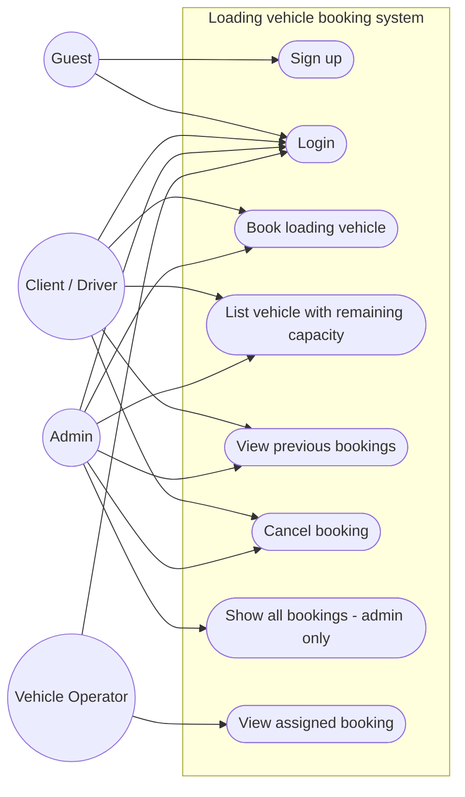
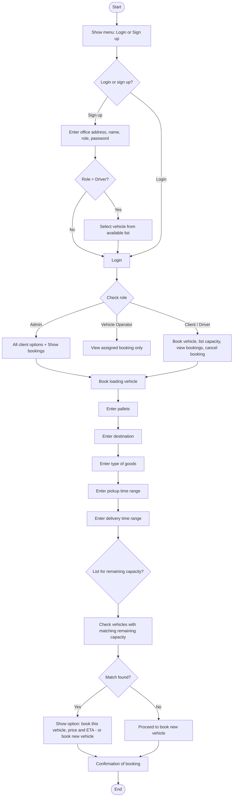

## Actor (use case) diagram

```mermaid
flowchart LR
  Guest((Guest))
  Client((Client / Driver))
  Admin((Admin))
  Operator((Vehicle Operator))

  subgraph System[Loading vehicle booking system]
    UC1([Sign up])
    UC2([Login])
    UC3([Book loading vehicle])
    UC4([List vehicle with remaining capacity])
    UC5([View previous bookings])
    UC6([Cancel booking])
    UC7([Show all bookings - admin only])
    UC8([View assigned booking])
  end

  Guest --> UC1
  Guest --> UC2
  Client --> UC2
  Client --> UC3
  Client --> UC4
  Client --> UC5
  Client --> UC6
  Admin --> UC2
  Admin --> UC3
  Admin --> UC4
  Admin --> UC5
  Admin --> UC6
  Admin --> UC7
  Operator --> UC2
  Operator --> UC8
```

## Activity (flow) diagram

```mermaid
flowchart TD
  Start([Start]) --> Menu[Show menu: Login or Sign up]
  Menu --> Choice{Login or sign up?}

  Choice -- Sign up --> SU1[Enter office address, name, role, password]
  SU1 --> SU2{Role = Driver?}
  SU2 -- Yes --> SU3[Select vehicle from available list]
  SU2 -- No --> Login[Login]
  SU3 --> Login

  Choice -- Login --> Login

  Login --> RoleCheck{Check role}
  RoleCheck -- Admin --> AdminMenu[All client options + Show bookings]
  RoleCheck -- Vehicle Operator --> OpMenu[View assigned booking only]
  RoleCheck -- Client / Driver --> ClientMenu[Book vehicle, list capacity, view bookings, cancel booking]

  AdminMenu --> BookFlow[Book loading vehicle]
  ClientMenu --> BookFlow

  BookFlow --> B1[Enter pallets]
  B1 --> B2[Enter destination]
  B2 --> B3[Enter type of goods]
  B3 --> B4[Enter pickup time range]
  B4 --> B5[Enter delivery time range]
  B5 --> B6{List for remaining capacity?}
  B6 --> B7[Check vehicles with matching remaining capacity]
  B7 --> B8{Match found?}
  B8 -- Yes --> B9[Show option: book this vehicle, price and ETA - or book new vehicle]
  B8 -- No --> B10[Proceed to book new vehicle]
  B9 --> Confirm[Confirmation of booking]
  B10 --> Confirm
  Confirm --> End([End])
```

